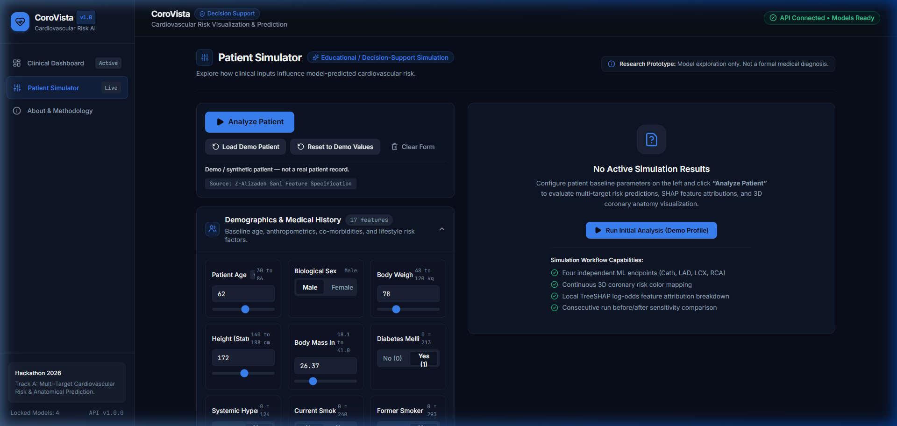
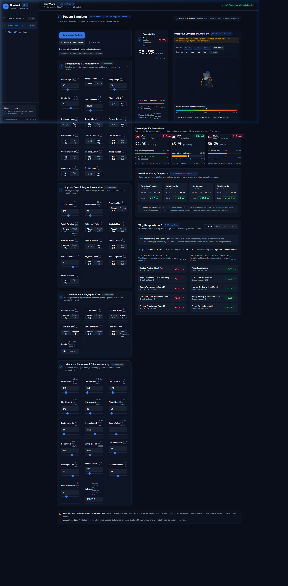
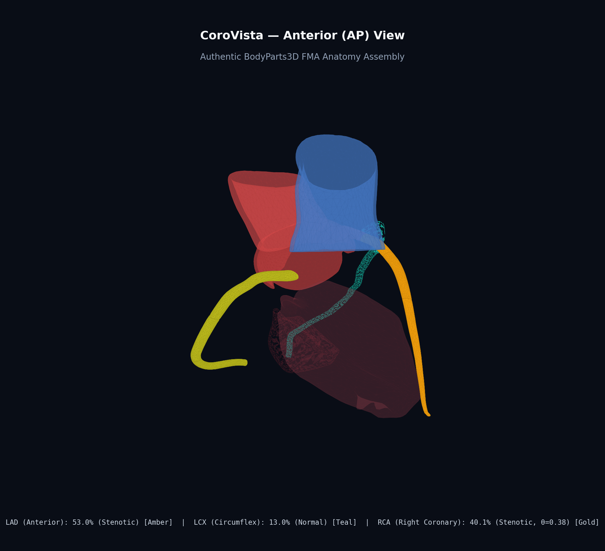
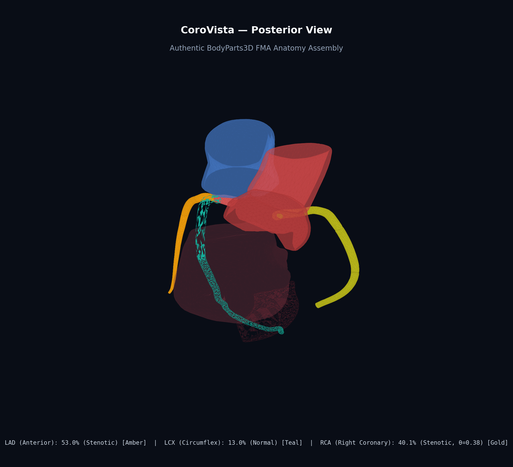
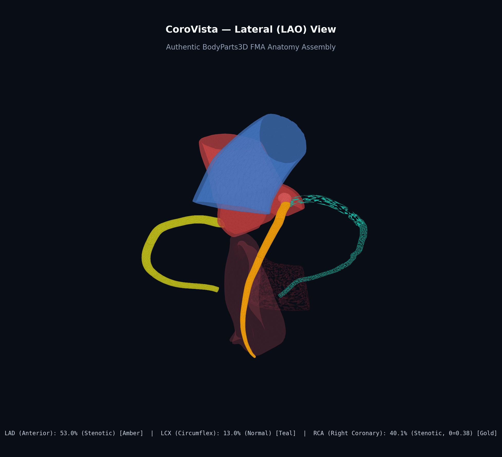
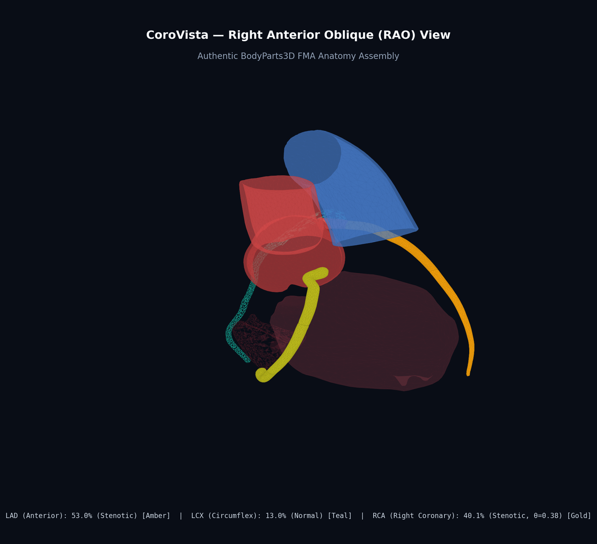

# CoroVista

> **Cardiovascular Risk Visualization & Multi-Target Stenosis Prediction System**  
> **Clinical Decision Support & Interactive Anatomical Digital Twin**

[](https://python.org)
[](https://fastapi.tiangolo.com)
[](https://react.dev)
[](https://threejs.org)
[](tests)
[](frontend/src/test)
[](LICENSE)
[](docs/anatomy-assets.md)

> [!IMPORTANT]
> **Clinical Decision-Support Disclaimer**: CoroVista is an educational and research decision-support software prototype. It is not an FDA-cleared diagnostic medical device, does not establish direct biological causality, and is not a substitute for clinical judgment, formal invasive coronary angiography (ICA), or coronary CT angiography (CCTA).

---

## 1. Executive Summary & Capabilities

**CoroVista** is an intelligent cardiovascular decision-support platform and anatomical digital twin. It integrates machine learning risk prediction with interactive 3D coronary anatomy rendering to assist clinicians, medical educators, and researchers in evaluating coronary artery disease (CAD):

1. **Multi-Target Risk Prediction**: Concurrently predicts overall **Coronary Artery Disease (CAD)** diagnosis (`Cath`) and vessel-specific obstructive stenosis ($\ge 50\%$) across the three primary coronary arteries:
   - **LAD**: Left Anterior Descending Artery
   - **LCX**: Left Circumflex Artery
   - **RCA**: Right Coronary Artery
2. **Interactive 3D Anatomical Digital Twin**: Renders an interactive 3D model of the human heart and coronary arterial tree derived from the open-source **BodyParts3D** anatomical repository (Foundational Model of Anatomy / FMA ontology), mapping predicted vessel stenosis probabilities directly onto anatomical branches via a dynamic continuous risk colormap.
3. **Local Explainability (SHAP)**: Provides patient-level feature attributions powered by Lundberg TreeSHAP and LinearSHAP, decomposing predictions into clinical risk-elevating and protective factors in exact model score (log-odds margin) space.
4. **Interactive Patient Simulator**: Enables clinicians to select representative patient archetypes or modify 54 clinical parameters in real time (e.g., blood pressure, ECG changes, lipid panel, ejection fraction) with instant sensitivity recalculations and visual before/after delta comparisons.
5. **Production REST API**: Delivers a low-latency, stateless FastAPI backend with strict target leakage prevention, Pydantic data normalization, and uniform error envelopes.

---

## 2. Visual Previews & System Interface

### Interactive Patient Simulator & Sensitivity Analysis
The Patient Simulator enables interactive exploration of 54 clinical variables, calculating real-time risk shifts and highlighting key positive/negative feature drivers:

| Patient Simulator Workspace | Real-Time Sensitivity Analysis |
|:---:|:---:|
|  |  |

### 3D Coronary Anatomy & Multi-Angle Digital Twin
High-resolution anatomical meshes with risk-driven colormaps, transparent myocardial context, and vessel-specific raycasting:

| Anterior View (LAD & Aortic Root) | Posterior View (LCX & AV Groove) |
|:---:|:---:|
|  |  |

| Lateral View | Right Anterior Oblique (RAO) View |
|:---:|:---:|
|  |  |

---

## 3. Core Features

- **Clinical Risk Dashboard**: Pre-loaded clinical archetypes (Typical CAD, Low-Risk Normal, Isolated LAD Stenosis, Multivessel CAD) with 1-click loading, multi-vessel progress gauges, and threshold badges.
- **Dynamic Patient Simulator**: 4-category clinical drawer covering Demographics, Symptoms & Exam, ECG Findings, and Echo & Laboratory values, complete with automatic BMI calculation and input validation.
- **Interactive 3D Heart Viewer**: Built with Three.js and React Three Fiber, featuring orbit controls, anatomical structure visibility toggles (Myocardium, Aorta, Pulmonary Trunk, Septum), emissive risk pulsing, and WebGL error recovery.
- **SHAP Feature Attribution Cards**: Expandable positive (risk-elevating) and negative (protective) waterfall breakdowns with translation to standard medical terminology and units.
- **Target Leakage Safeguard**: Strict isolation of ground-truth target columns (`Cath`, `LAD`, `LCX`, `RCA`) across input validation gates, raising an immediate `422 Unprocessable Content` response if present.

---

## 4. System Architecture

CoroVista is built as a fully decoupled, production-ready full-stack application:

```text
+----------------------------------------------------------------------------------------------------+
|                                    React 19 Frontend Web Application                                |
|  - Interactive 3D Heart Viewer (Three.js / React Three Fiber / @react-three/drei)                  |
|  - Patient Clinical Simulator Controls (54 Real-Time Parameters & Archetype Profiles)               |
|  - Vessel Risk Gauges with Calibrated Cutoffs & High/Critical Risk Badges                          |
|  - SHAP Waterfall & Feature Impact Cards with Medical Terminology Mappings                          |
+----------------------------------------------------------------------------------------------------+
                                                  │
                                                  │ REST / JSON (FastAPI CORS)
                                                  ▼
+----------------------------------------------------------------------------------------------------+
|                                      FastAPI Backend API Service                                    |
|  backend/app/                                                                                      |
|  ├── routes/       → /health, /models, /features, /predict, /explain, /analyze                      |
|  ├── schemas/      → Pydantic V2 Request & Response Validation with Leakage Detection              |
|  ├── services/     → Orchestrator for Multi-Target Inference & Explainability Engines               |
|  └── core/         → Configuration, CORS Origins, Uniform Error Envelopes                          |
+----------------------------------------------------------------------------------------------------+
                          │                                                  │
                          ▼                                                  ▼
+----------------------------------+   +---------------------------------------------+
|                Inference Engine                  |   |            Explainability Engine            |
|            src/corovista/inference/              |   |        src/corovista/explainability/        |
|  - Authoritative Leakage Gate (Rejects Targets)  |   |  - Native XGBoost Lundberg Tree SHAP        |
|  - Pipeline Preprocessing & Categorical Cleaning |   |  - LinearExplainer for Regularized Logistic |
|  - Calibrated Probability Scoring (Platt/Sigmoid)|   |  - Multi-Fold Calibrated Ensemble Averaging |
|  - Thresholded Binary Classification             |   |  - Additivity Verification: ∑ φ_j + φ_0 = f |
+----------------------------------+   +---------------------------------------------+
                          │                                                  │
                          └───────────────────────┬──────────────────────────┘
                                                  ▼
+----------------------------------------------------------------------------------------------------+
|                                     Serialized Model Artifacts                                     |
|  models/                                                                                           |
|  ├── cad/  → XGBoost + Platt/Sigmoid Calibration (Decision Threshold = 0.50)                       |
|  ├── lad/  → XGBoost + Platt/Sigmoid Calibration (Decision Threshold = 0.50)                       |
|  ├── lcx/  → XGBoost Uncalibrated (Decision Threshold = 0.50)                                      |
|  └── rca/  → Regularized Logistic Regression + Platt Calibration (Decision Threshold = 0.38)       |
+----------------------------------------------------------------------------------------------------+
                                                  ▲
                                                  │
+----------------------------------------------------------------------------------------------------+
|                                3D Anatomical Mesh Digital Twin Assets                               |
|  frontend/public/models/ (Optimized GLB Binary Meshes from BodyParts3D / FMA Ontology)              |
|  ├── corovista_heart.glb          → Complete Pre-Aligned Assembly (2.4 MB total)                   |
|  ├── vessel_lad.glb, vessel_lcx.glb, vessel_rca.glb → Multi-Segment Joined Arterial Trunks         |
|  └── struct_lv_wall.glb, struct_aorta_bulb.glb, struct_pulmonary_trunk.glb → Reference Context     |
+----------------------------------------------------------------------------------------------------+
```

For complete technical contracts, see [`docs/architecture.md`](docs/architecture.md).

---

## 5. Technology Stack

| Component | Technology | Version | Purpose |
|---|---|---|---|
| **Frontend Framework** | React | 19.2 | Component architecture & state management |
| **Language** | TypeScript | 5.x / 6.x | End-to-end type safety |
| **3D Graphics Engine** | Three.js | R186 | WebGL scene rendering & shaders |
| **React 3D Bridge** | React Three Fiber / Drei | 9.8 / 10.7 | Declarative 3D component hierarchy |
| **Styling & Design** | Tailwind CSS | 3.4 | Modern clinical dark-mode aesthetic |
| **Charts & Metrics** | Recharts | 3.10 | Sensitivity delta and probability charts |
| **Icons** | Lucide React | 1.53 | Accessible clinical and system icons |
| **Backend Framework** | FastAPI | 1.0.0 | High-performance asynchronous REST API |
| **Data Validation** | Pydantic | v2 | Request/response schemas and leakage gates |
| **Machine Learning** | Scikit-learn / XGBoost | 1.3+ / 2.0+ | Pipeline training, calibration, inference |
| **Explainability** | SHAP | 0.44+ | TreeSHAP and LinearSHAP attributions |
| **Anatomical Meshes** | Trimesh / BodyParts3D | — | 3D mesh alignment, optimization & GLB packaging |
| **Automated Testing** | Pytest / Vitest | 9.x / 5.x | 107 full-coverage automated test cases |

---

## 6. Machine Learning Methodology & Benchmarks

All pipelines were validated using **Repeated Stratified K-Fold Cross-Validation (5 Folds × 5 Repeats = 25 independent evaluation splits)** with strict feature isolation to guarantee zero data leakage.

| Target | Clinical Endpoint | Selected Model | Preprocessing | Calibration | ROC-AUC (Mean ± Std) | PR-AUC (Mean ± Std) | Balanced Accuracy | Brier Score | Decision Cutoff |
|---|---|---|---|---|---|---|---|---|---|
| **Cath** | Overall CAD Status | **XGBoost** | One-Hot / None | Sigmoid (Platt) | **0.910 ± 0.041** | **0.958 ± 0.021** | 0.843 ± 0.056 | **0.108** | 0.50 |
| **LAD** | Left Anterior Descending | **XGBoost** | One-Hot / None | Sigmoid (Platt) | **0.836 ± 0.049** | **0.878 ± 0.041** | 0.763 ± 0.056 | **0.165** | 0.50 |
| **LCX** | Left Circumflex | **RandomForest / XGBoost** | One-Hot / None | Uncalibrated | **0.724 ± 0.065** | **0.608 ± 0.086** | 0.662 ± 0.060 | **0.210** | 0.50 |
| **RCA** | Right Coronary Artery | **LogisticRegression** | One-Hot / Standard | Sigmoid (Platt) | **0.716 ± 0.060** | **0.613 ± 0.075** | 0.666 ± 0.048 | **0.225** | 0.38 |

### Key Machine Learning Findings:
1. **Target Leakage Safeguard**: Feature extraction strictly isolates target columns (`Cath`, `LAD`, `LCX`, `RCA`). If any target is detected in the input feature matrix, the pipeline raises an immediate `TargetLeakageError`.
2. **Probability Calibration**: Sigmoid Platt calibration significantly reduces probability calibration error (Brier score $< 0.11$ for Cath), providing reliable continuous risk estimates for driving the 3D colormaps.
3. **Threshold Calibration**: The optimal decision threshold for RCA is calibrated to **0.38** to optimize sensitivity and balanced accuracy for right coronary lesions.
4. **Ablation Studies**: Removing `Region RWMA` results in an acceptable minor drop ($-0.021$ for LAD, $-0.010$ for Cath), demonstrating robust predictive power across core clinical and laboratory features without over-reliance on echocardiographic wall motion scores.

---

## 7. Dataset Description & Provenance

CoroVista is trained and evaluated on the **Extended Z-Alizadeh Sani cardiology dataset** ($N = 303$ patients, 54 pre-catheterization clinical features):

### Clinical Feature Categories (54 Features Total):
- **Demographics (4)**: Age, Sex, Weight, Length (BMI dynamically derived).
- **Symptoms & Physical Examination (11)**: Chest pain types (Typical, Atypical, Non-anginal), Dyspnea, Blood Pressure, Pulse Rate, Heart Sounds, Edema.
- **Electrocardiography / ECG (11)**: ST elevation/depression, T-wave inversion, Q waves, Rhythm, Bundle branch blocks (LBBB, RBBB).
- **Laboratory Tests (15)**: Fasting blood glucose (FBS), Lipid panel (Total Cholesterol, Triglycerides, LDL, HDL), Serum Creatinine, BUN, Potassium, Sodium, ESR, WBC, Lymphocytes, Neutrophils, Platelets.
- **Echocardiography (13)**: Left Ventricular Ejection Fraction (`EF-TTE`), Regional Wall Motion Abnormality (`Region RWMA`), Valvular Heart Disease (`VHD`).

### Prediction Target Distributions:
- `Cath`: Obstructive CAD confirmed by catheterization (216 CAD [71.3%] / 87 Normal [28.7%]).
- `LAD`: $\ge 50\%$ diameter stenosis in the LAD vessel (177 Stenotic [58.4%] / 126 Normal [41.6%]).
- `LCX`: $\ge 50\%$ diameter stenosis in the LCX vessel (119 Stenotic [39.3%] / 184 Normal [60.7%]).
- `RCA`: $\ge 50\%$ diameter stenosis in the RCA vessel (114 Stenotic [37.6%] / 189 Normal [62.4%]).

For the exhaustive data quality audit and feature inventory, see [`data/reports/dataset_audit.md`](data/reports/dataset_audit.md).

---

## 8. Explainability & Visualization Methodology

The explainability layer in [`src/corovista/explainability/`](src/corovista/explainability/) provides mathematically rigorous, local feature attribution:

### Exact Additivity in Model Score Margin Space
SHAP attributions are computed strictly in the **underlying model score / log-odds margin space**:
$$\sum_{j=1}^{M} \phi_j(x) + \phi_0 = f(x)$$
Where $\phi_0$ is the base expected value, $\phi_j$ is the attribution of feature $j$, and $f(x)$ is the uncalibrated model score.

### Technical Implementation:
- **Tree-Based Models (Cath, LAD, LCX)**: Uses native C++ Lundberg TreeSHAP via XGBoost booster `predict(pred_contribs=True)`.
- **Linear Models (RCA)**: Evaluated using `shap.LinearExplainer` over transformed, scaled feature matrices.
- **Calibrated Classifier Averaging**: For Platt-calibrated models (`CalibratedClassifierCV`), SHAP values are extracted across all underlying fold estimators and averaged.
- **Clinical Terminology Translation**: Automatically maps technical feature names to standard medical nomenclature:
  - `EF-TTE` $\to$ *Ejection Fraction (Echocardiography)*
  - `Tinversion` $\to$ *T-Wave Inversion (ECG)*
  - `Region RWMA` $\to$ *Regional Wall Motion Abnormality*
  - `TG` $\to$ *Triglycerides (mg/dL)*
  - `Typical Chest Pain` $\to$ *Typical Anginal Chest Pain*

### Dynamic 3D Vascular Colormap
Arterial branches transition smoothly according to predicted stenosis risk:
- 🟢 **Low Risk ($p < 30\%$)**: Clinical Emerald (`#10b981`)
- 🟡 **Moderate Risk ($30\% \le p < 50\%$)**: Clinical Amber (`#f59e0b`)
- 🟠 **High Risk ($50\% \le p < 75\%$)**: Warning Orange (`#f97316`)
- 🔴 **Critical Risk ($p \ge 75\%$)**: Acute Rose (`#ef4444`)

For full mathematical documentation, see [`docs/explainability.md`](docs/explainability.md).

---

## 9. Local Setup & Execution Instructions

### Prerequisites
- **Python**: Version 3.10 or 3.11
- **Node.js**: Version 18.x or 20.x+ (with `npm`)

---

### Step 1: Install Python Dependencies & Package
From the project root:
```bash
pip install -e .
```

---

### Step 2: Start the FastAPI Backend Service
```bash
uvicorn backend.app.main:app --host 0.0.0.0 --port 8000 --reload
```
- API Base URL: `http://localhost:8000/api/v1`
- Interactive Swagger UI: `http://localhost:8000/docs`
- Health Check: `http://localhost:8000/api/v1/health`

---

### Step 3: Start the React Frontend Application
In a separate terminal:
```bash
cd frontend
npm install
npm run dev
```
- The application will be accessible at: `http://localhost:5173`

---

### Step 4: Run Automated Test Suites

CoroVista includes **107 automated tests** spanning ML integrity, API contracts, and React/Three.js components:

```bash
# 1. Run Backend & ML Pytest Suite (59 Tests)
pytest

# 2. Run Frontend Vitest Suite (48 Tests)
cd frontend
npm run test

# 3. Verify Frontend Production Build & Types
cd frontend
npm run build
```

---

## 10. Backend REST API Endpoints

The backend is built with FastAPI and runs on port `8000`.

| Method | Endpoint | Description |
|---|---|---|
| `GET` | `/api/v1/health` | Service health status and model cache readiness verification |
| `GET` | `/api/v1/models` | Model registry, algorithms, calibrations, and decision thresholds |
| `GET` | `/api/v1/features` | Metadata for all 54 features (ranges, types, units, defaults) |
| `POST` | `/api/v1/predict` | Multi-target prediction (`cath`, `lad`, `lcx`, `rca`) with probabilities |
| `POST` | `/api/v1/explain` | Single-target SHAP waterfall attribution breakdown |
| `POST` | `/api/v1/analyze` | Comprehensive evaluation: 4 predictions + 4 SHAP explanations |

### Error Envelope & Target Leakage Handling:
Submitting any target column (`Cath`, `LAD`, `LCX`, `RCA`) triggers an instant `422 Unprocessable Content` response with a structured JSON error envelope:
```json
{
  "error": {
    "code": "INVALID_INPUT",
    "message": "Target leakage detected: Ground-truth target columns ['Cath'] cannot be provided.",
    "details": []
  }
}
```

For full schema definitions and curl examples, see [`docs/api.md`](docs/api.md).

---

## 11. Pipeline Automation Scripts

All artifacts in the repository are completely reproducible via standalone CLI scripts:

```bash
# 1. Run Complete Dataset Audit
python scripts/audit_dataset.py

# 2. Run Multi-Target Cross-Validation Benchmarks & Calibration
python scripts/run_benchmarks.py

# 3. Convert & Optimize Anatomical Meshes into GLB Models
python scripts/convert_anatomy_meshes.py

# 4. Verify End-to-End Inference & SHAP Additivity
python scripts/verify_inference.py

# 5. Verify Backend REST API Endpoints & Contracts
python scripts/verify_backend.py
```

---

## 12. Clinical Boundaries & Limitations

1. **Non-Causality**: Feature attributions reflect observational statistical patterns in the Z-Alizadeh Sani cohort ($N=303$) and do not establish clinical cause-and-effect.
2. **Probability vs. Spatial Lesion Coordinates**: Predicted vessel probabilities indicate functional likelihood of obstructive stenosis ($\ge 50\%$). They **do not** correspond to 3D lesion coordinates, plaque length, or voxel segmentations.
3. **Cohort Representation**: The dataset reflects pre-catheterization patients referred to a tertiary cardiology center; performance should be calibrated if deployed in lower-prevalence primary care populations.
4. **Regulatory Status**: Research and educational decision-support prototype only. Model outputs do not replace formal coronary angiography or physician diagnosis.

---

## 13. License & Attributions

- **Software Codebase**: [MIT License](LICENSE).
- **Anatomical Meshes**: The 3D heart and coronary artery models are derived from **BodyParts3D**, developed by the Database Center for Life Science (DBCLS), Japan, licensed under [Creative Commons Attribution-ShareAlike 2.1 Japan (CC BY-SA 2.1 JP)](https://creativecommons.org/licenses/by-sa/2.1/jp/deed.en).
- **Clinical Dataset**: Extended Z-Alizadeh Sani cardiology dataset.

---

## 14. Future Improvements & Roadmap

- **Containerization**: Docker and Docker Compose definitions for one-command multi-service deployment.
- **Spatial UI Enhancement**: High-fidelity spatial interaction layouts for simultaneous 3D heart manipulation and clinical parameter tuning.
- **HL7 / FHIR Integration**: Adapters to ingest standard Electronic Health Record (EHR) patient summaries directly into simulator fields.
- **Bundle Optimization**: Dynamic code-splitting for `@react-three/fiber` and Three.js vendor chunks.

---

*CoroVista — Cardiovascular Risk Visualization & Prediction System*
